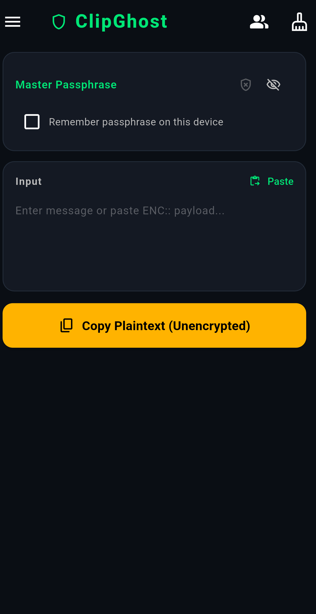
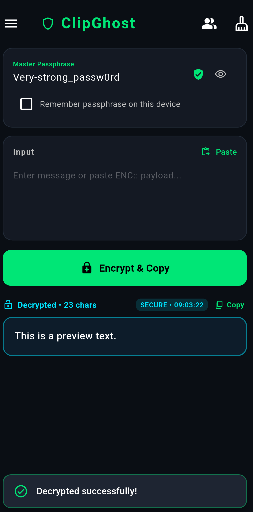
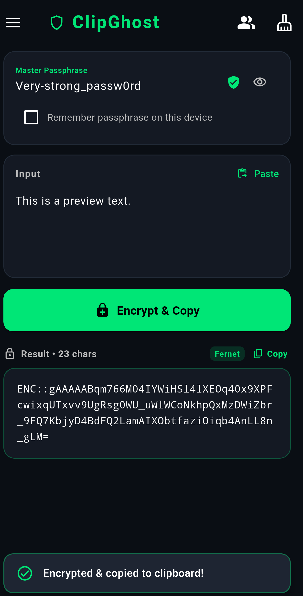
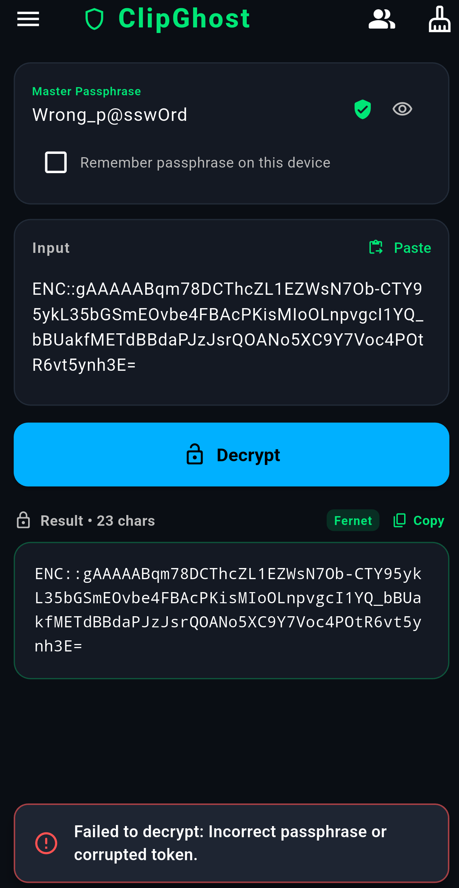

# 🛡️ ClipGhost

> **Zero-Knowledge, Air-Gapped Clipboard Encryption Tool for Android**

ClipGhost is a lightweight, offline security utility designed to turn any messaging app, email client, or note-taking service into an end-to-end encrypted channel without relying on third-party servers, network sockets, or account registrations.

[](https://github.com/kovacsmaxi/clipghost/releases/latest)

---

## 📱 Application Preview

<p align="center">
  
  
  
  
</p>

---

## ⚡ Key Highlights

* **Air-Gapped Operation:** Zero internet permissions required (`android.permission.INTERNET` is completely omitted). No analytics, telemetry, tracking, or remote endpoints.
* **Payload-Aware Reactive UI:** Automatically detects `ENC::` tokens upon pasting or resuming the app, immediately handling decryption and cleanup.
* **Military-Grade Cryptographic Stack:** Full implementation of the Fernet specification utilizing AES-128-CBC with 480,000 PBKDF2 iterations and HMAC-SHA256 authentication.
* **Multi-Contact Keyring:** Manage individual secret passphrases for different contacts with one-tap switching.
* **Instant Clipboard Sanitization:** Optional automatic clipboard wiping immediately after plaintext exposure to mitigate Android clipboard-history logging.
* **Bilingual & Global Ready:** Native support for 22 world languages and adaptive high-contrast Cyber Dark and Clean White themes.

---

## 🔒 Cryptographic Architecture

ClipGhost adheres strictly to authenticated symmetric encryption standards, fully compatible with Python standard cryptography.fernet engine:

| Layer | Specification |
| :--- | :--- |
| **Cipher** | AES-128 in CBC mode (PKCS7 Padding) |
| **Key Derivation** | PBKDF2 with HMAC-SHA256 (480,000 iterations) |
| **Authentication** | HMAC-SHA256 across Version + Timestamp + IV + Ciphertext |
| **Transport Format** | URL-Safe Base64 string prefixed with `ENC::` |

### Token Anatomy (`ENC::<base64>`)

```text
0x80 (1 byte) || Timestamp (8 bytes) || IV (16 bytes) || Ciphertext (N bytes) || HMAC-SHA256 (32 bytes)
```

* **Version (`0x80`):** Identifies the Fernet payload version.
* **Timestamp:** 64-bit big-endian unsigned integer recording token creation time down to the second.
* **IV (Nonce):** 16 cryptographically secure random bytes generated uniquely per encryption routine.
* **Ciphertext:** AES-128-CBC encrypted plaintext with PKCS7 padding.
* **HMAC Signature:** 32-byte message authentication code verified via constant-time comparison to prevent timing attacks.

---

## 🚀 Features

### 1. Smart Action Dispatcher
The primary action button dynamically shifts state based on input context:
* **Encrypt & Copy:** Active when typing standard plaintext with an active passphrase.
* **Decrypt:** Automatically engages the moment an `ENC::` payload is inserted or pasted.
* **Copy Plaintext (Warning):** Visual fallback when operating without an active passphrase in non-strict mode.

### 2. Streamlined Clipboard Hygiene
* **Auto-Paste on Open:** Automatically reads valid `ENC::` tokens when returning from background apps.
* **Instant Decrypt & Wipe:** Immediately decrypts incoming tokens and purges system clipboard memory.
* **Configurable Auto-Clear:** Automated field purging post-encryption to keep screens clear of sensitive drafts.

### 3. Contact Key Manager
Store partner profiles locally. Switch communication channels without manually retyping long master keys each time.

### 4. Custom Themes & Adaptivity
* **Cyber Dark:** Deep obsidian backgrounds with neon green, electric blue, red alert, or amber accents.
* **Clean White:** High-contrast daylight theme with teal accents and clear typography.

---

## 📥 Download & Installation

The pre-compiled production binary is readily available:
1. Go to the [Releases page](https://github.com/kovacsmaxi/clipghost/releases/latest).
2. Download **`ClipGhost.apk`** from the **Assets** section.
3. Install the APK on your device (grant installation permission if prompted).

---

## 🛠️ Building From Source

### Prerequisites
* [Flutter SDK](https://flutter.dev) (stable channel, 3.x or later)
* Android SDK (API Level 21+)

### Build APK Locally
```bash
git clone https://github.com/kovacsmaxi/clipghost.git
cd clipghost

flutter pub get
flutter build apk --release
```

The compiled binary will be located at:
```text
build/app/outputs/flutter-apk/app-release.apk
```

---

## ☕ Support the Project

ClipGhost is free, open-source, and entirely independent. If this tool helps secure your private communications or workflow, consider supporting its continued maintenance and development:

[](https://ko-fi.com/kovacsmaxi)

---

## 📄 Privacy Policy

ClipGhost is built with zero-data retention. It does not collect, store, transmit, or process personal telemetry or clipboard data. Read the full [Privacy Policy](PRIVACY.md).

---

## 📄 License

This project is licensed under the MIT License — see the [LICENSE](LICENSE) file for details.
